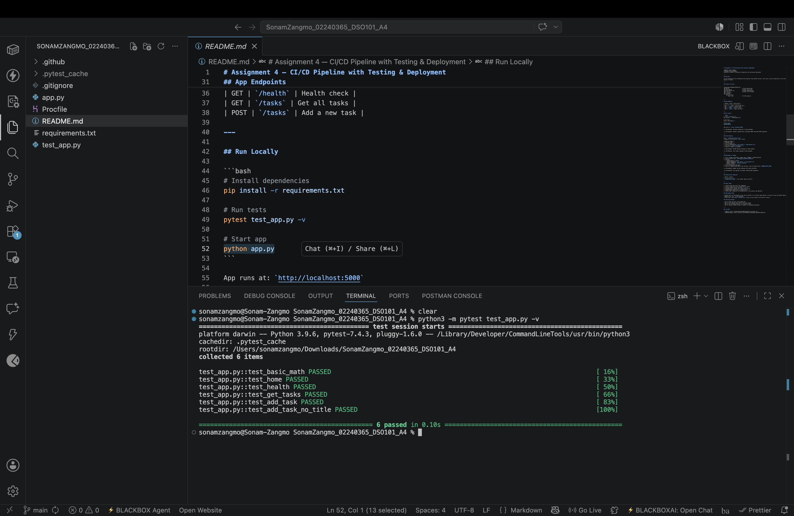
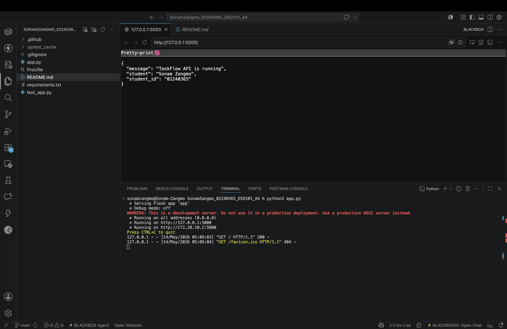
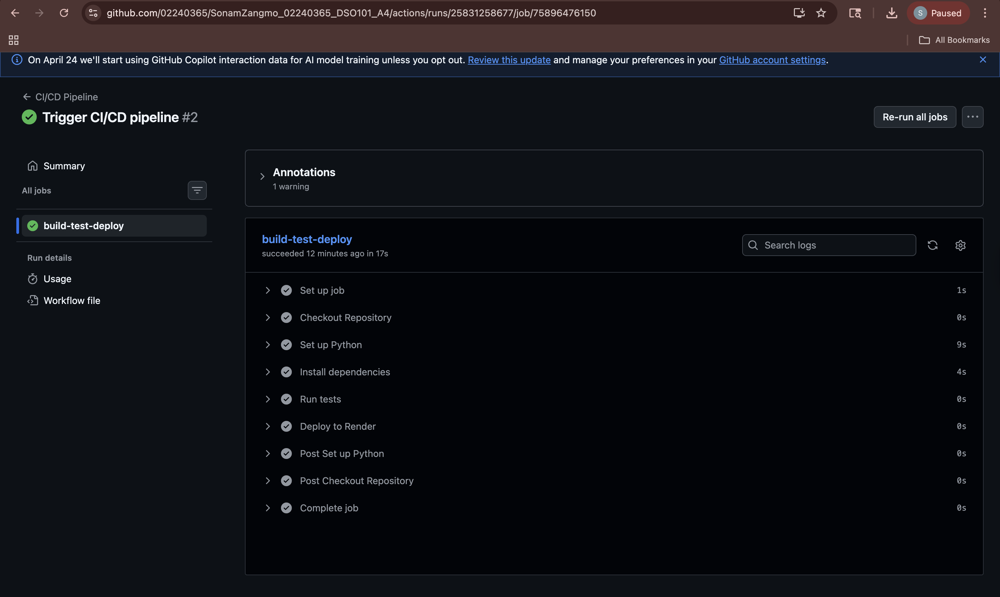
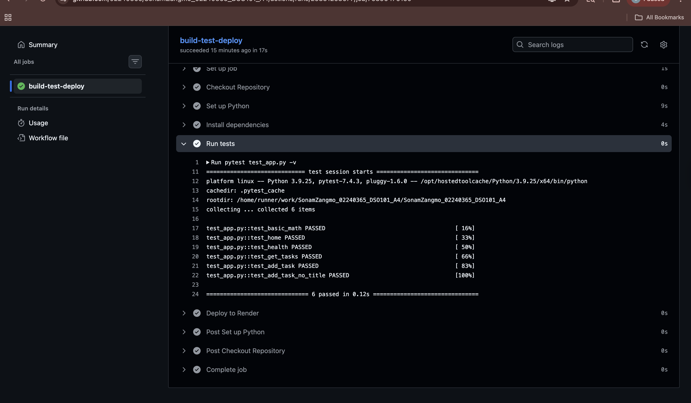
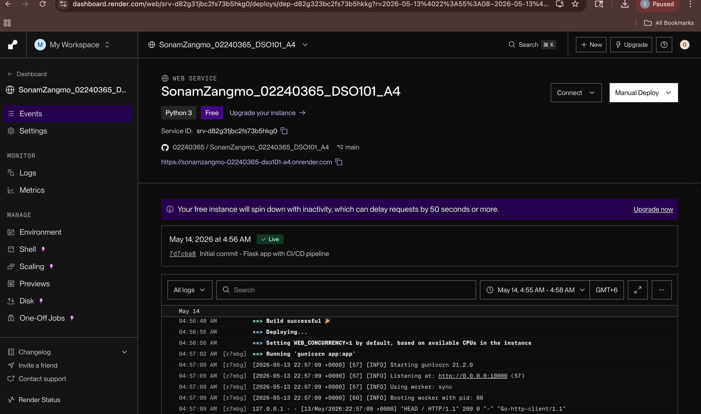
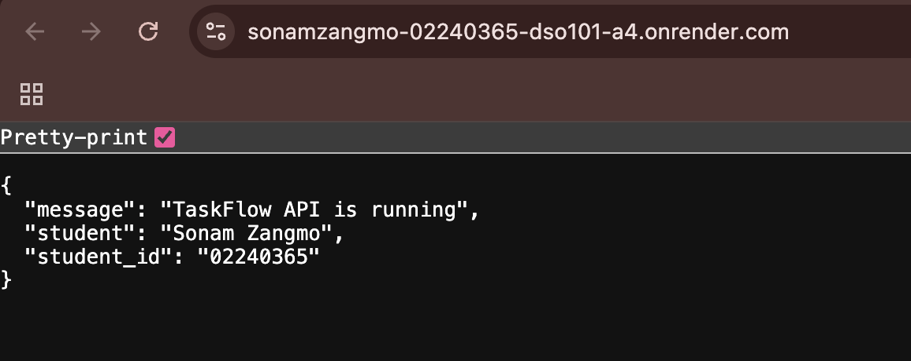

# Assignment 4 - CI/CD Pipeline with Testing & Deployment

**Name:** Sonam Zangmo  
**Student ID:** 02240365  
**Course:** DSO101 — Continuous Integration and Continuous Deployment

---

## Overview

A Flask backend API with automated CI/CD pipeline using GitHub Actions. Every push to main automatically runs tests and deploys to Render.

---

## Project Structure

```
sonamzangmo_02240365_DSO101_A4/
├── app.py                        # Flask backend app
├── test_app.py                   # Pytest unit tests
├── requirements.txt              # Python dependencies
├── Procfile                      # Render start command
├── .gitignore
└── .github/
    └── workflows/
        └── ci.yml                # CI/CD pipeline
```

---

## App Endpoints

| Method | Route | Description |
|--------|-------|-------------|
| GET | `/` | Home - returns app info |
| GET | `/health` | Health check |
| GET | `/tasks` | Get all tasks |
| POST | `/tasks` | Add a new task |

---

## Run Locally

```bash
# Install dependencies
pip install -r requirements.txt

# Run tests
pytest test_app.py -v

# Start app
python app.py
```

App runs at: `http://localhost:5000`

📸 **Terminal showing all 6 tests passed**



📸 **Browser showing http://localhost:5000 returning JSON response**


---

## CI/CD Pipeline

File: `.github/workflows/ci.yml`  
Triggers on every push to `main` branch.

**Pipeline Steps:**
1. Checkout code
2. Set up Python 3.9
3. Install dependencies (`pip install -r requirements.txt`)
4. Run tests (`pytest test_app.py -v`)
5. Deploy to Render via webhook

📸 **GitHub Actions showing all steps green**



📸 **Test output showing 6 tests passed**



---

## Deployment on Render

1. Go to [render.com](https://render.com) → **New** → **Web Service**
2. Connect GitHub repo `sonamzangmo_02240365_DSO101_A4`
3. Settings:
   - **Environment:** Python
   - **Build Command:** `pip install -r requirements.txt`
   - **Start Command:** `gunicorn app:app`
   - **Plan:** Free
4. Click **Create Web Service**
5. Copy the **Deploy Hook URL** from Settings → add as GitHub Secret `RENDER_DEPLOY_HOOK`

📸 **Render service showing Live status and URL**



📸 **Live app URL in browser showing JSON response**



---

## GitHub Secret Required

| Secret | Value |
|--------|-------|
| `RENDER_DEPLOY_HOOK` | Your Render deploy hook URL |

---

## Steps Taken

1. Created Flask app with 4 API endpoints
2. Wrote 6 pytest unit tests covering all routes
3. Created GitHub Actions workflow (`ci.yml`)
4. Deployed app to Render as a Python web service
5. Added Render deploy hook as GitHub Secret
6. Pushed code - pipeline ran automatically, tests passed, app deployed

## Challenges Faced

- Render does not auto-deploy on git push by default for existing image deploys - solved by using the Render Deploy Hook URL triggered via `curl` in the workflow.
- Flask test client needs `TESTING=True` config to work properly with pytest fixtures.

## Learning Outcomes

- How to build and test a Flask REST API
- How to write pytest tests with Flask test client
- How to set up GitHub Actions for a Python project
- How to connect GitHub Actions to Render for automated deployment

---

## Live URL

- **App:** https://sonamzangmo-02240365-dso101-a4.onrender.com  
- **GitHub Repo:** https://github.com/02240365/SonamZangmo_02240365_DSO101_A4.git